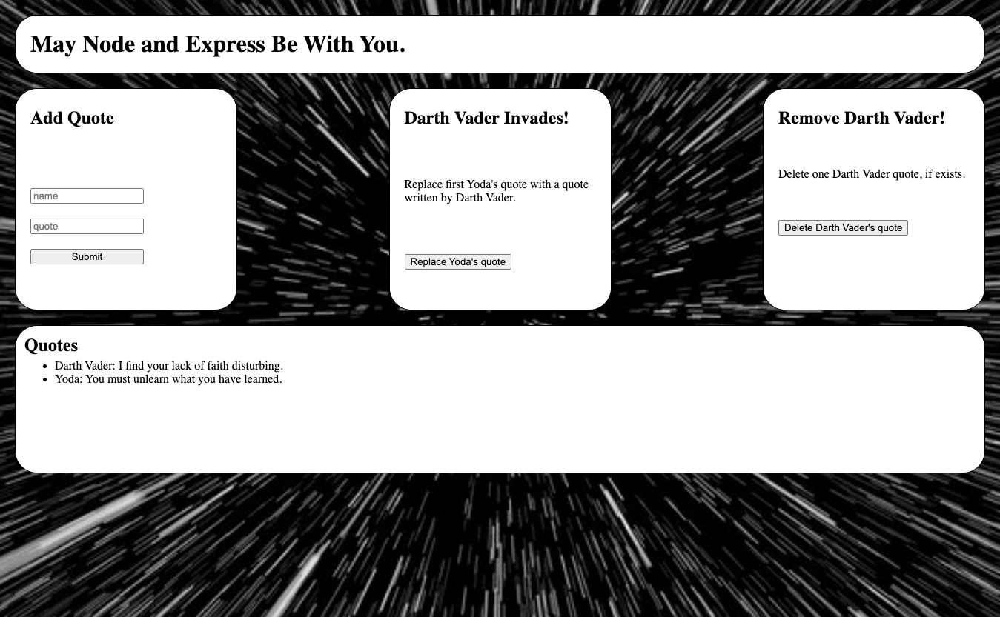

# Star Wars Quotes 

## License
   

   Please click on the badge to view license info.
   

## Description
This is an application to show proficiency with CRUD operations with the help of Star Wars!

## Deployed Application
https://salty-inlet-60606.herokuapp.com/

## Table of Contents

- [License](#license)
- [Description](#description)
- [Deployed Application](#deployed-application)
- [Installation](#installation)
- [Usage](#usage)
- [Visuals](#visuals)
- [Tests](#tests)
- [Contributors](#contributors)
- [Contact](#contact)

## Installation
None.

## Usage
To have fun.

## Visuals

## Tests

No.

## Contributors

Sherreka S. Burton

## Contact

If you have any questions about this project please contact: Sherreka S. Burton

Github: [ssbbgm](http://github.com/ssbbgm)

Email: ssburto825@gmail.com

